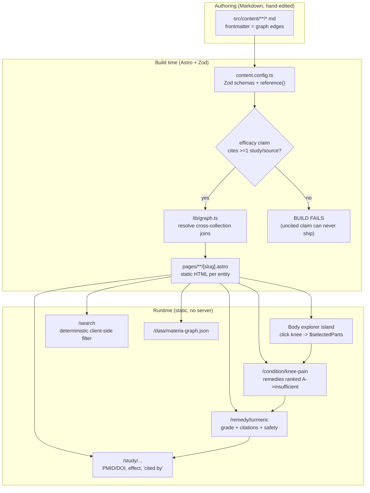

# How Materia works, end to end

This is the **teaching** page. If you have never touched the codebase, start
here: it follows a single question all the way through the system, names each
part it passes, and links to the canonical page for the details. It restates
nothing that already has a home — [`overview.md`](overview.md),
[`data-model.md`](data-model.md), [`explorer.md`](explorer.md), and the
[ADRs](decisions/) are the source of truth; this page is the map that connects
them.

## The one idea

Materia is the *"Examine.com of the whole body"*: point at a body part, and it
tells you which remedies are studied for the conditions there, **how strong the
evidence is** (a letter grade), and **exactly which studies back that grade**.
The whole product is one traversal:

> **body part → condition → remedy → compound → study**

Two rules make it trustworthy rather than just another supplement site:

1. **Cited-or-it-fails.** No efficacy claim can exist without a citation. This
   is enforced by the *build*, not by good intentions.
2. **Embeddings, not generation.** Any AI on the site *ranks and retrieves*
   vetted, cited passages. It never *writes* medical prose. (Shipped search is
   even simpler — see [below](#search-what-actually-ships-vs-what-was-designed).)

Everything else is a consequence of those two rules plus one architectural
bet: model the join as a real graph.

## The pieces (and where they live)

Materia is a **static Astro site** — HTML generated once at build time, no
server at runtime. The moving parts:

| Piece | File | Role |
| --- | --- | --- |
| The schema | [`src/content.config.ts`](../../src/content.config.ts) | Six content collections + Zod + `reference()`. The graph's shape and its invariants. |
| The content | `src/content/<collection>/*.md` | Hand-authored Markdown. **The frontmatter *is* the graph** — edges are `reference()`s to other files. |
| The joins | [`src/lib/graph.ts`](../../src/lib/graph.ts) | Build-time helpers that resolve cross-collection edges so pages never re-implement a join. |
| The pages | `src/pages/**/[slug].astro` | One statically-rendered page per entity (`part`, `condition`, `remedy`, `compound`, `study`). |
| The explorer | `src/components/react/*` + `src/lib/explorer/` | The **only** hydrated surface: a clickable 2D/3D body. See [`explorer.md`](explorer.md). |
| The safety checker | `src/pages/checker.astro` + `getCheckerData()` | Client-side interaction checker over typed `interactsWith` edges. |
| The graph export | [`src/pages/data/materia-graph.json.ts`](../../src/pages/data/materia-graph.json.ts) | Emits the entire graph as nodes + edges JSON for external tools. |

The six collections and their edges are documented once in
[`data-model.md`](data-model.md); the six-node/edge vocabulary in
[ADR 0002](decisions/0002-knowledge-graph-first-class-compounds-studies.md).
Don't re-read the schema to understand the flow — read the flow here, open the
schema only when authoring.

## Following one query through the system

Say a user lands on the body explorer and clicks **knee**, then follows it to a
condition. Here is what each layer actually does.



### 1. Anatomy entity — the body part

The explorer is a React island (the only hydrated code on the site). Clicking a
region writes a **slug** into a nanostores atom (`$selectedParts`); the renderer
knows nothing about the graph — it exchanges part ids only. The clickable parts
come from `getExplorerParts()` in
[`graph.ts`](../../src/lib/graph.ts), which shapes each `bodyParts` entry into
the serializable `ExplorerPart` the island needs. Each body part carries a
`reference()` list of the conditions located there. The renderer contract and
the 2D↔3D seam are documented in [`explorer.md`](explorer.md) — not repeated
here.

### 2. Evidence graph — the condition page

Following a body part's condition link lands on `/condition/<slug>`
([`src/pages/condition/[slug].astro`](../../src/pages/condition/%5Bslug%5D.astro)).
That page calls `getConditionView(condition)`, which does two joins:

- resolves the condition's affected body parts (the reverse edge), and
- calls `remediesForCondition(slug)` — which scans every remedy's `efficacy`
  array for a claim whose `condition` reference matches, then **sorts by grade**
  (A first, `insufficient` last) using `GRADE_RANK` in `graph.ts`.

So the condition page is literally the answer to *"what may help, ranked by how
sure we are?"* — and the ranking is computed from the graph, not hand-ordered.

### 3. Graded remedy — the remedy page

Each remedy links to `/remedy/<slug>`
([`src/pages/remedy/[slug].astro`](../../src/pages/remedy/%5Bslug%5D.astro)),
which calls `getRemedyView(remedy)`. That helper resolves, for every efficacy
claim: the `condition` it targets, the `grade`, the plain-language `summary`,
the traditional-medicine alignment, **and the citations** (via
`resolveClaimCitations`). It also pulls the remedy's compounds and its typed
interaction edges. Grade display (letter, colour, label) comes from
[`src/lib/grades.ts`](../../src/lib/grades.ts) — the grade *vocabulary* is
defined once in the schema, rendered once here.

### 4. Citations — the study page

Every grade is only as good as what backs it, so citations are first-class. A
`studies` entry becomes `/study/<slug>` carrying design, `n`, effect, and
`PMID`/`DOI`. Because studies are their own collection (not inline strings),
`getStudyCitedBy(slug)` can render the reverse edge — *"every remedy×condition
claim that cites this study"* — turning a single paper into a hub. That
compounds-and-studies-as-nodes bet is [ADR 0002](decisions/0002-knowledge-graph-first-class-compounds-studies.md);
its payoff (combinatorial internal linking + a research-transparency posture) is
the moat.

### Sideways: the safety checker and the graph export

Two surfaces read the *same* graph differently:

- **`/checker`** flattens remedies via `getCheckerData()` and, in the browser,
  cross-references a user's stack against the typed `interactsWith` edges *plus*
  keyword-matched additive-risk classes (e.g. two blood thinners). See the
  interaction-edge note in [`data-model.md`](data-model.md#typed-interaction-edges).
- **`/data/materia-graph.json`** walks all six collections and emits the whole
  thing as `nodes` + `edges` (schema `materia-knowledge-graph/v1`) so external
  tools consume exactly what the site renders — no scraping.

## Search: what actually ships vs. what was designed

This is the most common point of confusion, so it gets its own section.

- **What ships today:** [`src/pages/search.astro`](../../src/pages/search.astro)
  builds a small JSON index at build time (title, summary, url, kind, aliases
  for every part/condition/remedy/compound), inlines it into the page, and
  filters it **client-side with a deterministic substring/token match** — every
  query token must appear in the haystack. No model, no ranking, no network. It
  is boring on purpose: fast, offline, and impossible to hallucinate.
- **What was designed (deferred):** the same index was meant to become the base
  layer for a **small client-side embedding model** that does semantic ranking
  and RAG over the cited content. That is [ADR 0005](decisions/0005-embeddings-not-generative-medical-model.md),
  and it is *deferred* under the 2026-07 finish-and-pause — the code comment in
  `search.astro` ("Phase 2 adds client-side embeddings on top of this
  deterministic baseline") marks the seam.

The crucial invariant survives either way: search can only ever surface content
that already passed the citation build gate.

## The two decisions that shape everything — and why

### Cited-or-it-fails (a build gate, not a promise)

The `efficacyClaim` schema in
[`content.config.ts`](../../src/content.config.ts) ends with:

```ts
.refine((c) => c.studies.length + c.sources.length > 0, {
  message: 'Each efficacy claim must cite at least one study or source.',
});
```

Astro runs Zod validation during the build, so **an uncited medical claim fails
the build**. There is no runtime fallback and no lint-warning escape hatch.

*Why this shape?* Trust is the whole product, and "every claim is cited" has to
be a **guarantee, not a convention** — a human review step leaks under content
churn. Making it a schema `refine` means adding a grade and adding its citation
are the *same edit*; you physically cannot ship one without the other. The
rejected alternatives (runtime check, CI-only check) and the reasoning are in
[ADR 0003](decisions/0003-build-enforced-citations.md). The companion policy —
*don't invent PMIDs/DOIs* — is [ADR 0006](decisions/0006-citation-verification-policy.md).

### Embeddings, not a generative medical model

When AI does arrive, it will **rank and retrieve**, never generate. The reasons
are researched, not aesthetic: no browser-runnable medical LLM exists, the one
capable small model is license-barred from patient-facing use, medical
fine-tunes underperform generalists (RAG > fine-tuning), and generative medical
prose creates exactly the liability the trust posture forbids. Full reasoning:
[ADR 0005](decisions/0005-embeddings-not-generative-medical-model.md), which
sits under the "trust as a hard constraint" umbrella
([ADR 0004](decisions/0004-trust-as-hard-constraint.md)). Because the model
would only ever rank content that already cleared the citation gate, the trust
guarantee extends onto the AI surface for free.

## Where to go next

- **Author content:** [`development/authoring-content.md`](../development/authoring-content.md)
  and the schema in [`content.config.ts`](../../src/content.config.ts).
- **The graph in depth:** [`data-model.md`](data-model.md).
- **The interactive body:** [`explorer.md`](explorer.md).
- **Every "why":** [`decision-log.md`](../decision-log.md) → [`decisions/`](decisions/).
- **What isn't built yet / open questions:** [`../../STATUS.md`](../../STATUS.md).
